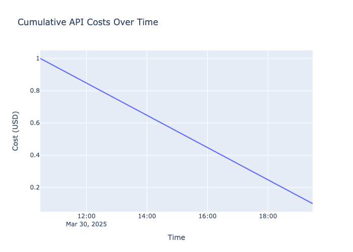
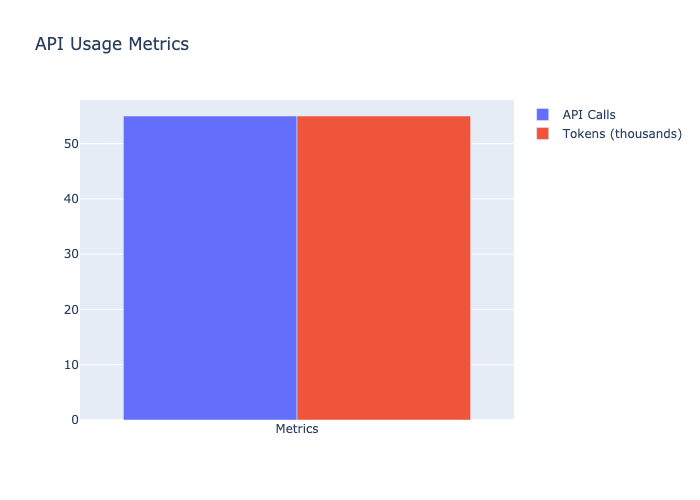
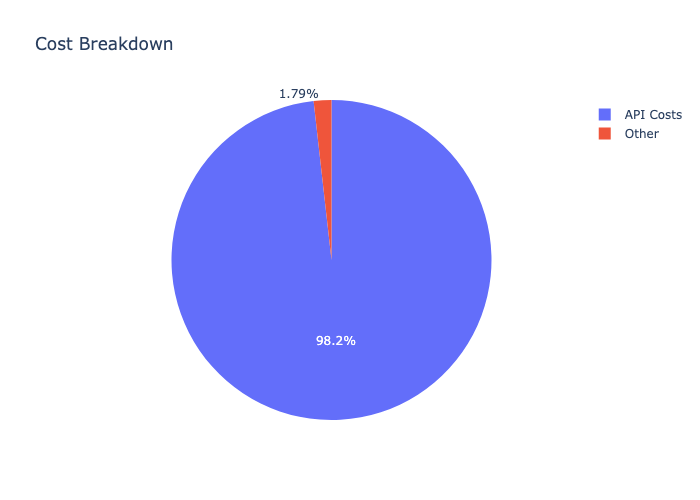
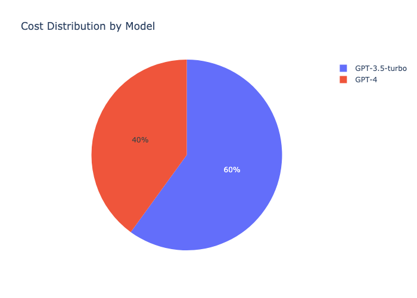
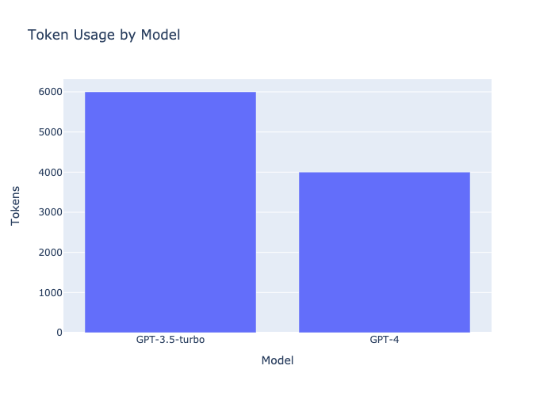

# API Test Generator with MLflow Tracking

This project automatically generates API test suites from Swagger UI documentation using LLMs (GPT-3.5/GPT-4) and tracks all operations using MLflow.

## Features

- 🔄 Automatic scraping of Swagger UI documentation
- 🤖 LLM-powered endpoint extraction and test generation
- 📊 Comprehensive MLflow tracking of:
  - API costs per model
  - Token usage
  - Execution times
  - Test results
- 📝 BDD-style test generation with Gherkin syntax
- 🔄 CI/CD pipeline with GitHub Actions
- 📈 Visual reporting and metrics

## Project Structure

```
.
├── features/                    # Generated BDD feature files
├── step_definitions/           # Generated step definition files
├── reports/                    # Test execution reports
├── mlruns/                     # MLflow tracking data
├── docs/                       # Documentation and visualizations
├── .github/
│   └── workflows/
│       └── ci.yml             # CI/CD pipeline
├── main.py                     # Main script
├── mlflow_tracking.py         # MLflow tracking module
├── pytest.ini                 # Pytest configuration
└── requirements.txt           # Project dependencies
```

## Setup

1. Clone the repository:
```bash
git clone <repository-url>
cd <repository-name>
```

2. Install dependencies:
```bash
pip install -r requirements.txt
```

3. Set up environment variables:
   - Create a `.env` file locally with:
     ```
     OPENAI_API_KEY=your_openai_api_key
     MLFLOW_TRACKING_URI=your_mlflow_uri
     ```
   - For GitHub Actions, add these as repository secrets:
     - Go to Settings > Secrets and Variables > Actions
     - Add `OPENAI_API_KEY` and `MLFLOW_TRACKING_URI`

## Usage

Run the main script to generate tests:
```bash
python main.py
```

This will:
1. Scrape the Swagger UI
2. Extract endpoint information
3. Generate feature files
4. Create step definitions
5. Track all operations in MLflow

## MLflow Tracking

### Metrics Tracked

1. **API Costs**
   - Cost per model (GPT-3.5/GPT-4)
   - Total cost per run
   - Cost per API call

2. **Token Usage**
   - Total tokens used
   - Tokens per API call
   - Token usage rate (tokens/second)

3. **Execution Metrics**
   - Total execution time
   - Time per operation
   - Success/failure rates

### Visualizations

1. **Cost Over Time**
   
   - Shows cumulative API costs during execution
   - Helps identify cost-intensive operations

2. **API Usage Distribution**
   
   - Displays token usage and API call counts
   - Helps optimize token usage

3. **Cost Breakdown**
   
   - Shows cost distribution across different operations
   - Helps identify cost drivers

4. **Model-specific Costs**
   
   - Distribution of costs across different models
   - Helps optimize model selection

5. **Token Usage by Model**
   
   - Token consumption per model
   - Helps identify token-intensive operations

## CI/CD Pipeline

The GitHub Actions workflow:

1. **Test Job**
   - Runs on every push and pull request
   - Sets up Python environment
   - Installs dependencies
   - Runs tests with MLflow tracking
   - Generates HTML reports
   - Uploads artifacts

2. **Deploy Job**
   - Runs only on main branch
   - Deploys to production
   - Tracks deployment metrics
   - Reports success/failure

### Environment Variables

Required GitHub Secrets:
- `OPENAI_API_KEY`: Your OpenAI API key
- `MLFLOW_TRACKING_URI`: Your MLflow tracking server URI

## Test Reports

Test execution generates two types of reports:

1. **HTML Report** (`reports/report.html`)
   - Detailed test results
   - Test execution time
   - Pass/fail statistics
   - Error details

2. **BDD Report** (`reports/bdd_report.html`)
   - Feature file execution results
   - Step definition coverage
   - Scenario outcomes

## Cost Tracking

The system tracks costs per model:

| Model | Cost per 1K tokens |
|-------|-------------------|
| GPT-3.5-turbo | $0.002 |
| GPT-4 | $0.03 |

Costs are tracked in real-time and visualized in MLflow. The system provides:
- Per-model cost breakdown
- Token usage analysis
- Cost optimization recommendations
- Historical cost trends

## Contributing

1. Fork the repository
2. Create a feature branch
3. Commit your changes
4. Push to the branch
5. Create a Pull Request

## License

MIT License - see LICENSE file for details 